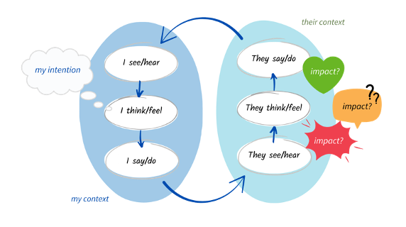
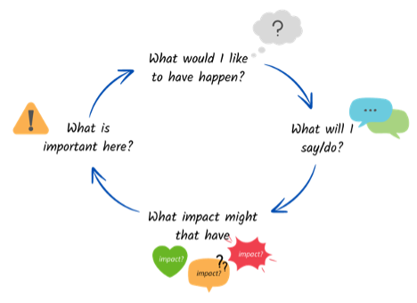

# 5	**Intentional Conversations**

>“A good intention, with a bad approach, often leads to a poor result.”
>-Thomas Edison

We have considered how context gives us a way to make meaning of the world, and how it defines the assumptions we make. Our intentions also play a key part in our conversations. 

Intentional conversations are purposeful and have a depth to the interaction. They harness our ability to reason, judge and form conclusions in pursuit of an outcome.

We tend to place intentional conversations in the context of work or education. For example, they might be oriented towards problem-solving, decision-making, sales and marketing, performance management, developing relationships, attending to mental or physical health. There will be times where we need to think about communicating our needs and goals in our personal lives. 

Casual, unplanned and unhurried conversations are also important. Often, these will be wide-ranging and informal. These types of conversations are crucial to maintaining relationships and wellbeing. They can also yield surprising insights, spark creativity and allow sharing of tacit knowledge and wisdom. Casual conversations are important in work, education and in our personal lives.
Casual conversations give rise to intentional conversations and vice versa. Strong relationships will have a balance of intentional and casual conversations, to reinforce shared values and beliefs, and deepen social bonds.

Social connection comes from understanding both your own and the other person’s context and having a shared set of experiences, language and identity. Understanding your own and another’s context comes from a series of conversations. Frequent, short conversations have more cumulative effect than occasional, longer conversations, because they are reinforcing and multiplicative. If you have a desire to improve your conversations over the longer term, the occasional disagreements or moments of discomfort are less likely to derail the relationship.

In this course we focus on introducing intentional conversations. It’s a complex area however there are a few things you can do to prepare for an intentional conversation (and there will be conversations where this is worth doing). Preparing for conversations helps improve the effectiveness of the conversation[^9]. We’ll start by considering motivations, then outcomes, then intentions and impact.

## 5.1	Motivations

Motivations are what drives us to action. Motivations they are linked to your emotions and needs (your state). They are grounded in your current reality and past experiences.

You may find it helpful to consider what is motivating you in a conversation and where those motivations come from.

A direct question to yourself to uncover your motivations might be:

- **What do I want to say/do?**

Be free in your thinking (you may surprise with what you uncover). Then consider these questions:

-	**What’s important here?**

-	**Where does that come from?**

-	**What causes it to be like that?**

Motivations are often complex, unclear and may be confusing. It is helpful to reflect on these before a conversation that is important to you.

## 5.2	Outcomes

Outcomes are the anticipated or actual results or effects of decisions and actions. They can often be measured or observed by other people. 

Some common purposes and outcomes for conversations are:

1.	**Information Exchange**: sharing or gathering facts and knowledge e.g. sharing news, researching information, giving instructions
2.	**Problem-Solving and Decision-making**: discovering new ideas or perspectives and developing solutions and reaching conclusions with others e.g. brainstorming new ideas, developing strategies and options, deciding actions.
3.	**Coordination and Planning**: organising joint action and workflows, sharing resources across groups of people to achieve a set of objectives e.g. scheduling activities, organising an event, allocating work across a team.
4.	**Performance and Compliance**: evaluating performance and meeting standards e.g. reviewing employee or student performance, peer review, quality audits.
5.	**Persuasion and Negotiation**: influencing others and making agreements e.g. discussing a sale, negotiating a contract, agreeing priorities.
6.	**Cultural Transmission**: sharing collective values, beliefs, identity, cultural knowledge and traditions e.g. making oaths and vows, sharing organisational norms with someone new, explaining historical events.
7.	**Conflict Resolution**: addressing and resolving disagreements e.g. mediating disputes.
8.	**Personal Development**: enhancing self-awareness and skills e.g. receiving career mentoring, coaching, attending skills training.
9.	**Emotional Expression and Support**: providing and receiving comfort and support e.g. counselling, celebrating good news, discussing health issues
10.	**Social Bonding**: building relationships and sustaining connections e.g. small talk, sharing an interest/hobby, volunteering

The list is loosely ordered from the highly informational to the highly relational[^10] contexts, although no conversation can be completely one or the other. All conversations have multiple types of outcomes carried within them. If a conversation seems important to you or the other person, it is worth considering both the information you are communicating and the relational outcomes.

Deciding on your desired outcomes gives direction to the conversation. Consider what information might be shared and what might happen to the relationship between you. Also consider what has happened historically (in a particular environment) as this can give an indication of what the other person might expect or want from the conversation. 

 When communicating information that has significant consequences for others consider how you will engage them, explain how the decisions are made and what happens after that as the process of communicating is sometimes more important than the outcome itself[^11]. You might have to plan a series of conversations to achieve this.

Useful orienting questions to ask yourself to find out about the outcomes you want and that are realistic are:

- **What would I like to have happen?**

- **What happens next?**

- **And can that happen?**

You can also have someone else ask you these questions and the ones in the previous section to help you to explore outcomes. These questions are also useful to clarify the outcomes that other people might be struggling to define.

- **What would you like to have happen?**

- **And then what happens?**

- **And can that happen?**

## 5.3	Intentions

An intention is a course of action or plan, and a commitment to carry out that plan. Intentions are thoughts that bridge our motivations (what we want) and the actions that will move us closer to what we want (what we say or do). They are strategies for success.

Intentions guide our what we communicate. They can be multi-faceted and complex, and line motivations, not always known to us. They are always contextual. Be aware that your state affects your intentions because your underlying motivations change.

You can think about your future actions and behaviours to help clarify your intentions. Questions  that can make your intention more concrete are:

-**What will I say/do?**

-**How will I be?**
Intentions, like motivations are complex and can be difficult to identify. If the conversation is important or carries some risk, you might find it help to discuss your intentions and motivations with a friend, colleague or a conversation with a professional adviser (a coach, HR expert, lawyer etc.) 

Take time to explore your intentions – they may possibly conflict with each other or the outcomes you want to achieve. That might cause your behaviour to appear inconsistent to others over time or cause them to doubt your intentions. 

Things to consider alongside the broader questions above are:

- **How to open the conversation**

- **What questions you intend to ask**

- **The key points you want to make**

- **What questions you might be asked**

The questions we ask will also depend on how the conversation unfolds – some of the questions in Section 4 are useful to keep in mind as they do not rely on assumptions made ahead of a conversation.

## 5.4	Impact

Impact can be thought of as effects on us or the other person, a subjective experience, associated with thoughts and feelings (state). They are often felt first.

If a conversation is not going well for us, we may attribute the emotions we experience to the other person, thinking they are ‘making us’ feel that way. But what we are feeling and thinking is personal to us. Our previous experiences, values and beliefs are really what make us react.  

We can learn to manage our response and reframe our thinking if we are able to notice our state, judge whether it is helpful or not in the situation we are in and use strategies to move ourselves to a more resourceful state. 

Reflexive questions that address impact are:

- **What impact did  that have (on me)?**

- **What’s happening (for me) right now?**

A question that can uncover the unconscious and immediate reaction after a significant moment in the conversation is:

- **What happened (for me) just before ___ ?**

Be aware that asking questions like this of another person requires mutual trust, as otherwise they can feel intrusive and inappropriate in some contexts.

Summary of questions:

| Type | Question |
| --- | --- |
| **Motivation** | What's important for me? What's important for the other person? How will I know? |
| **Outcomes** | What would you like to have happen in this conversation? Then what happens? Consider informational and relational outcomes, and the context for the conversation. |
| **Intention** | What will you say or do? How will you be? Consider how to open, questions to ask, key points you want to make, and what questions you might be asked. |
| **Impact** | What impact might that have on the other person? How will you know? Consider what you know of the other person's context, what they may say or do in response and the longer-term impact on your relationship. |

## 5.5	Separating Intention from Impact

An intention (action-directed thought) is different to an impact (what’s experienced). The diagram below shows intention on the left  and the possible impacts on the other person on the right, framed in terms of state. This diagram can be flipped – the other person has an intention in what they communicate (unknown to us), and we experience the impact of that communication, and make assumptions and meaning based on that impact.

% TODO: Image is not centered

We can have the best of intentions towards another person and find out that the impact on them was not what we expected or wanted it to be. Sometimes, our intentions may not be that clear to us until after we have acted and reflected on what we said and did. Both these cases provide opportunities for learning, a chance to improve our conversations.

Often, we judge ourselves on the good intentions we have (we are the ‘good’ guys) and other people on the impact that we feel when interacting with them (they are the ‘bad’ guys). This can easily lead to misunderstandings and conflict. We each think we are right, and the other person is wrong. 

This thinking can arise because we each have different information available to us, we pay attention to different things or have different beliefs or values. We might each have incorrect assumptions about what is happening[^12]. 

Untangling intention and impact enable people to take responsibility and encourages agency (the ability to make decisions and act). Though conflict resolution is beyond the scope of this course, moving from a position of being ‘right’ to exploring mutual interests can help alleviate difficult situations. 

Some questions to ask yourself that help separate the impact on you from the intentions another person might have had arep[^13]:

- **What happened? What did I see and hear?**

- **What impact did that have on me?**

- **Based on that, what am I assuming about the other person and their intentions?**

## 5.6	Aligning Intentions with desired outcomes

As mentioned above, our intentions can be unclear or unknown to us. They reflect the assumptions we are making about future conversations. Those assumptions partly arise from the impact the other person had on us. 

We can also be influenced indirectly, before we have had a conversation with someone. Examples of indirect impact are when someone has told us something about that person or we have read something the person has written. 

Considering intentions in the light of the outcomes you want to achieve can help you decide how you want to have the conversation and whether you should have the conversation at that time. 

## 5.7	Preparing for intentional conversations

You can prepare for a conversation by cycling through the outcomes, intentions, possible impacts and motivations as shown below. Enter the loop at any point and move around it to gain clearer idea of how these four elements are helping or hindering your intended conversation. You can also use this to reflect on a past conversation. 

When considering impact, talk through this with trusted colleagues or friends. It will you understand how what you say or do ‘lands’ with other people before you commit to action. 

% TODO: Image is not centered

## 5.8	Final thoughts

We hope that you found this handbook a useful guide to the course. Please let us know if you have any comments or feedback that will help to improve it.

A deeper exploration of intentional or ‘difficult’ conversations is beyond the scope of this course. If you’d like to discuss the content or find out more about our work, please get in touch with us at hello@betterconversations.foundation.

[^9]: For an example from healthcare, see Stans et al., _Who Said Dialogue Conversations Are Easy?_.
[^10]: For a discussion on informational vs relational see Yeomans, Schweitzer, and Brooks, _The Conversational Circumplex_.
[^11]: For examples of why process matters see Kim and Mauborgne, _Fair Process_.
[^12]: Stone, Patton, and Heen, _Difficult Conversations_.
[^13]: Stone, Patton, and Heen.