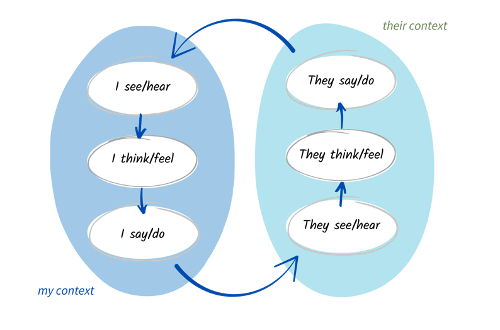

# 4	**Listening with Curiosity** – how can you influence a conversation?

>“The quality of your attention determines the quality of other people's thinking.”
> -Nancy Kline

In this section, we will extend the stimulus-response-context model to look at what happens in a conversation between two people and the importance of listening[^7] . Much of this applies to written communication, however there is less context available in the moment and there might be a delay in communication. Be mindful of how the different forms of communication can affect the information available to you and the assumptions you make. 

In the diagram below, we add a second stimulus-response-context process to the right-hand side of our original stimulus-response-context model. This second process is inverted to be able to represent a simplified conversational loop, which could represent a snapshot in time of the conversation.

% TODO: Image is not centered

We take our cues (our stimulus) from each other, process that information, add some of our own thoughts and feelings and respond to each other. We have explored how what we sense and how we make sense of it can impact conversations in previous sections. Each person brings their own context to a conversation, and acts within that context. Having good conversations can help us understand each other and helps us create a shared context to help us relate better in the future. Listening with curiosity means that we are listening in a way that attends to the other person and their experience, paying attention to how and what they are communicating, suspending judgement and being aware of the context we bring, and they bring to the conversation. Listening is a choice we make.

We think of this as creating a ‘container’ for a better conversation. You might have a different metaphor that works better for you.

## 4.1 Attention

There are multiple levels of communication happening when you interact with someone. There is the conversation that you have with the other person, the conversation they are having with you, the communication within yourself (mind and body) and the communication happening internally for the other person.

What you choose to pay attention has an impact on how the conversation you are having with the other person progresses.

## 4.2	Suspending Judgement

One reason for a conversation not going well is that one or both participants have misunderstood what the other person means. Another reason for a conversation not going well is that the participants want different outcomes. Here, their values and beliefs (part of their context) will be affecting the way they think and feel. Misunderstandings and wanting different things can result in conflict between two people.

Recognising that sensemaking is different to sensing reduces the scope to make unhelpful assumptions, inferences and judgements about the other person. Perhaps surprisingly, when you wholeheartedly focus on what their experience is like for them, you better manage your own state as well.

Some questions that might help you identify assumptions, inferences and judgements are:

- **What am I missing here?**

- **What assumptions might I be making here?**

- **How does my experience differ?**

## 4.3	Listening to understand

We can listen in different ways. We can listen to find a gap in which we express our own thoughts and feelings, or we can listen to find out more about what the other person thinks and feels. The second type of listening is more likely to result in the other person feeling accepted and heard.

Listening to understand requires you:

-	Place your full attention on the other person – noticing the words they use and how they say them (tone, pace etc.)

-	Notice any gestures and their body language of the other person; they are communicating through both verbal and non-verbal language.

-	Suspending judgement of what they are saying or doing: hold your assumptions lightly

-	Allow them to speak without interrupting with comments or questions

-	Encourage them to speak with affirmative and appropriate body language like nodding and smiling, and non-specific sounds like “mmm to indicate you are following what they are saying.

This type of listening helps improve conversations. It works because the other person has the space to express themselves and think well, and so they are much more likely to be able to manage their own state. It only takes a few minutes to build trust and rapport through authentic listening. 

## 4.4	Listening to enquire and extend understanding

Although it is impossible to fully appreciate another person’s context, or know their  innermost thoughts and feelings, it is possible to discover what is going on for the other person by asking questions. 

This requires you to:

-	Note some of the exact words they use

-	Use questions that minimise biases and assumptions

Initially, the words you can listen for are nouns and verbs which tell you about a concept or object, or an action. When you use their exact words within a question, it signals that you have heard the other person and that are curious about what they have just said. 
The questions given below are designed to reduce the assumptions and judgements that you may make. They can also be used for self-reflection.  

Many of the questions we introduce in this, and the following sections come from the field of Clean Language,  pioneered by David Grove[^8] . These questions are powerful in their reach. We advise you to keep it conversational and only ask one or two of these questions to ensure that the other person feels heard and not interrogated!

- What kind of ___ is that?

- Is there anything else about that ___?

- When you say___ I imagine___. Is that what you mean?

[^7]: For a full discussion about the importance of listening see Kline, _The Promise That Changes Everything_.
[^8]: For a comprehensive explaination of Clean Language questions see Lawley and Tompkins, _Metaphors in Mind_.